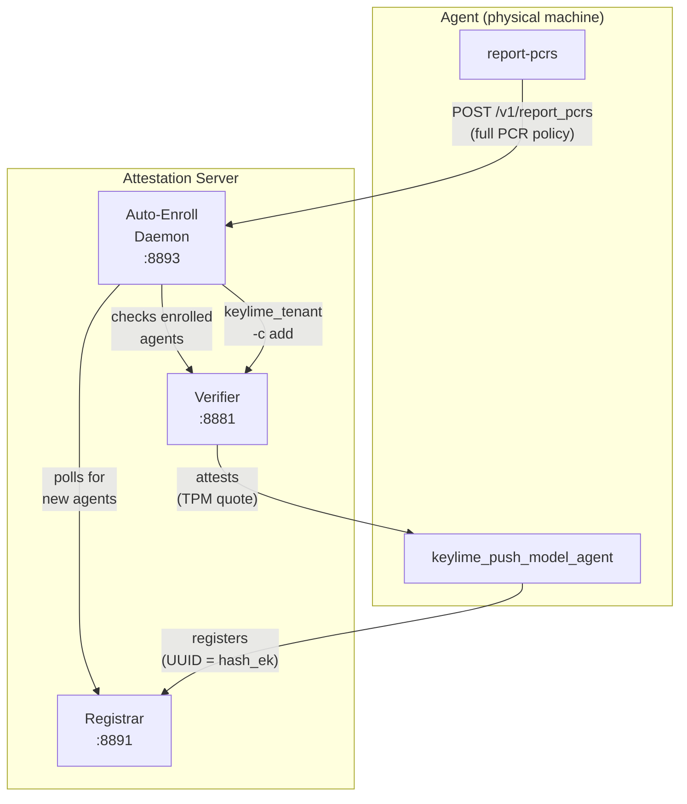
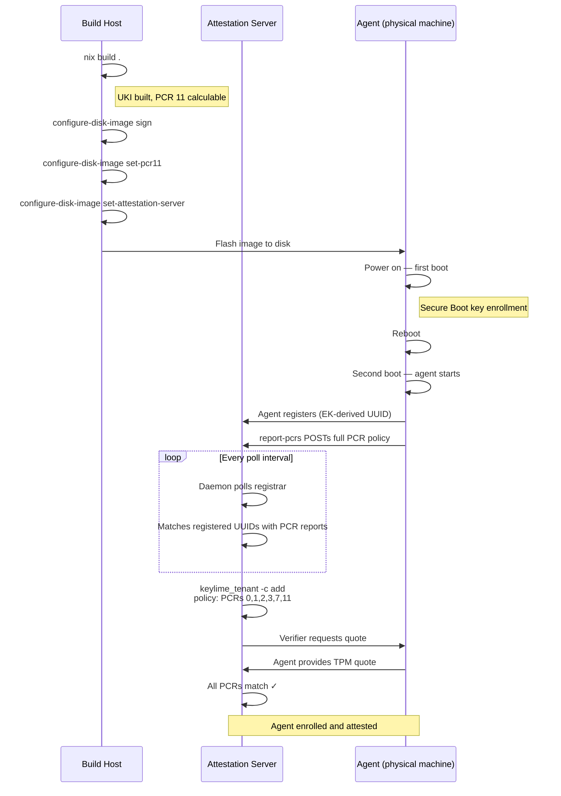

\pagebreak

# Overview

The auto-enrollment daemon automates the process of enrolling new
machines with the keylime attestation server.  Without it, each
new agent must be manually enrolled by an operator who has access
to both the agent machine (to read firmware PCR values) and the
attestation server (to run `keylime_tenant -c add`).

With auto-enrollment enabled, the flow becomes:

1. Build and sign the image.
2. Configure the attestation server address on the image.
3. Flash and boot the machine.
4. The agent registers automatically, reports its PCR values, and
   the daemon enrolls it with the full TPM policy — no manual
   intervention required.

The daemon enrolls agents with a **full PCR policy** covering
firmware PCRs (0–3, 7) and PCR 11.  PCR 11 is measured by
`systemd-stub` and `systemd-pcrphase` and captures the exact UKI
(kernel, initrd, command line) as well as the boot phase.
Firmware PCRs capture the hardware and Secure Boot state.

# Architecture



The daemon runs on the attestation server alongside the registrar
and verifier.  It:

1. Listens on an HTTPS endpoint (port 8893) for PCR reports from
   agents.
2. Periodically polls the registrar for registered agent UUIDs.
3. When an agent is both registered AND has submitted its PCR
   report, enrolls it with the verifier using the full policy.

On the agent side, `report-pcrs` runs as a oneshot systemd service
after the keylime agent registers.  It reads all PCR values from
the TPM, verifies PCR 11 against the expected value on the ESP,
and POSTs the policy to the daemon.

# Setup

## Prerequisites

- A working keylime attestation server with registrar, verifier,
  and mTLS certificates (see `system-manager/keylime.nix`).
- A built and signed NixOS Android Builder image with
  `set-pcr11` and `set-attestation-server` applied.

## Enable the Auto-Enrollment Daemon

The daemon is enabled in the system-manager configuration via:

```nix
services.keylime.autoEnroll.enable = true;
```

This is already the default in the repository's `systemConfigs.default`.
The daemon starts automatically after the registrar and verifier.

No additional deployment steps are needed — the agent reports its
PCR values directly to the daemon on boot.

## Configuration Options

All options live under `services.keylime.autoEnroll`:

| Option           | Default      | Description                                        |
|------------------|--------------|----------------------------------------------------|
| `enable`         | `false`      | Enable the auto-enrollment daemon.                 |
| `enrollPort`     | `8893`       | HTTPS port for the PCR report endpoint.            |
| `pollInterval`   | `10`         | Seconds between polling the registrar.             |
| `registrarIp`    | `127.0.0.1`  | Registrar address.                                 |
| `registrarPort`  | `8891`       | Registrar TLS port.                                |
| `verifierIp`     | `127.0.0.1`  | Verifier address.                                  |
| `verifierPort`   | `8881`       | Verifier port.                                     |

# Enrollment Flow in Detail

## Step-by-Step



## What Gets Verified

The full PCR policy verifies:

- **PCR 11**: The exact UKI (kernel, initrd, command line) that was
  built and signed is the one that booted, and the boot completed
  through the expected systemd phases (`sysinit` → `ready`).
- **PCRs 0–3**: UEFI firmware code, configuration, option ROMs,
  and their configuration have not been tampered with.
- **PCR 7**: Secure Boot state (keys, policy, boot variables) is
  unchanged.

## Trust Model

Firmware PCRs are accepted on a **trust-on-first-use (TOFU)** basis:
the agent self-reports its PCR values before the first attestation.
This is acceptable because:

- PCR 11 is verified locally against the build-time expected value
  before reporting — the agent must be running the correct image.
- After enrollment, the verifier validates all PCR values against
  the TPM quote on every attestation cycle — any false report is
  caught immediately.
- Once enrolled with the full policy, the agent cannot downgrade
  the policy — only an admin with verifier mTLS credentials can
  modify it.

# Updating the Image

When a new image is built and signed:

1. Run `set-pcr11` and `set-attestation-server` on the new image.
2. Flash and boot the new image on the agent.
3. The agent re-registers and reports its new PCR values.
4. The daemon detects the un-enrolled UUID and enrolls with the
   new policy.

**Note**: If the agent's UUID hasn't changed (same TPM EK), and it
is still enrolled on the verifier with the old policy, the new PCR
values will cause attestation to fail.  Delete the old enrollment
first:

```shell-session
$ keylime_tenant -c delete -u <agent-uuid> \
    -v <verifier-ip> -vp 8881
```

# Testing

The repository includes a NixOS VM test that exercises the full
auto-enrollment flow:

```shell-session
$ nix build -L .#checks.x86_64-linux.keylime-auto-enroll
```

The test:

1. Boots a two-node VM setup (server + agent).
2. Generates mTLS certificates and configures the agent.
3. Starts the auto-enrollment daemon.
4. Starts the agent, waits for registration, triggers `report-pcrs`.
5. Verifies the agent is automatically enrolled with the full PCR
   policy (PCRs 0, 1, 2, 3, 7, 11) and reaches the `Get Quote`
   attestation state.

# Troubleshooting

**Agent registers but is not enrolled**

Check the daemon logs (`journalctl -u keylime-auto-enroll`) for
enrollment errors.  The daemon waits for both registration AND a
PCR report before enrolling.  Common causes:

- The `report-pcrs` service failed — check agent logs
  (`journalctl -u keylime-report-pcrs`).
- mTLS certificate issues (expired, wrong CA).
- Port 8893 not reachable from the agent.
- The `keylime_tenant` binary is not in the daemon's `PATH`.

**report-pcrs fails with "PCR 11 mismatch"**

The agent's live PCR 11 does not match the expected value on the
ESP.  This happens when:

- `set-pcr11` was not run after signing.
- The agent is running a different image version.

**Agent is enrolled but fails attestation**

The TPM quote does not match the enrolled policy.  This can happen
after a firmware update or BIOS settings change that alters
firmware PCRs.  Delete the enrollment and let the agent re-enroll:

```shell-session
$ keylime_tenant -c delete -u <agent-uuid> \
    -v <verifier-ip> -vp 8881
```
